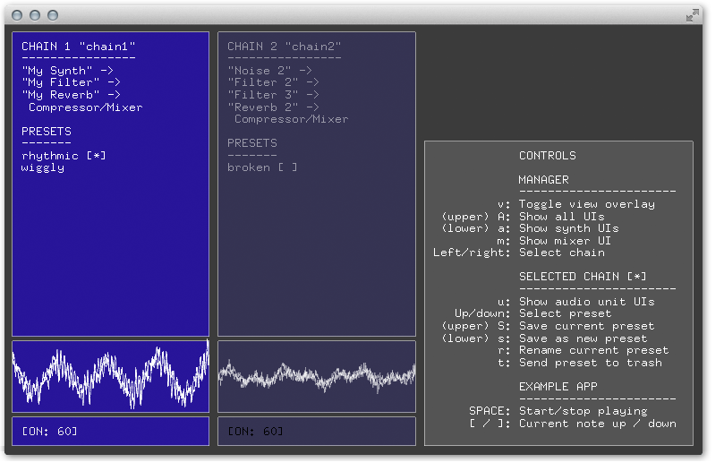
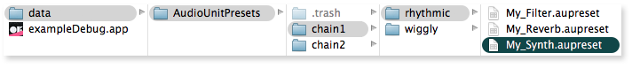

ofxAudioUnitManager
===================
This addon is a leightweight manager for Adam Carlucci's excellent [ofxAudioUnit](https://github.com/admsyn/ofxAudioUnit). It allows you to manage chains of Audio Units and presets with key presses at runtime, and to design new chains with just a few lines of code.



If you implement `ofxAudioUnitManager` in your sketch, you can show and hide the overlay above by hitting 'v'.

Why do I need a manager for ofxAudioUnit?
-----------------------------------------
You don't. The original addon on is awesome and lets you do great things with Audio Units.

I created this addon because I wanted to be able to experiment with sound quickly and fluidly. What `ofxAudioUnitManager` does is automate things you may find yourself doing manually with `ofxAudioUnit`, like connecting units together, saving and managing preset files and sending algorithmic MIDI sequences to synths for playback.

In other words, this addon lets you focus more on sound design, by automating a lot of the boilerplate engineering stuff.

How to create an Audio Unit chain
---------------------------------
A chain is a number of units in sequence. The first unit in the sequence will be a synth, or sound-generating unit. The subsequent units will be filters or other types of processing units that modulate the audio signal they recieve from the prior unit in the chain, whether that's the source synth or another filter in the chain.

First, the declarations:
```cpp
    ofxAudioUnitManager manager;
    ofxAudioUnitChain myChain;
    ofxManagedAudioUnit mySynth, myFilter, myReverb;
```

Second, define the synths (and give them a unique name):
```cpp
    mySynth.setup("My Synth", 'aumu', 'ncut', 'TOGU');
    myFilter.setup("My Filter", kAudioUnitType_Effect, kAudioUnitSubType_LowPassFilter);
    myReverb.setup("My Reverb", kAudioUnitType_Effect, kAudioUnitSubType_MatrixReverb);
```

Third, link the units to make a chain:
```cpp
    manager.createChain(&myChain)
           .link(&mySynth)
           .to(&myFilter)
           .to(&myReverb)
           .toMixer();
```

That's it. Your chain is good to go.

Those of you who used this addon prior to version 0.2.0 will notice how much simpler this is to do now.

How to play notes
-----------------
The manager exposes an [ofxBpm](https://github.com/mirrorboy714/ofxBpm) instance, allowing you to declare listeners which will fire at precise moments, such as beat events:

```cpp
    void ofApp::setup() {
        ofAddListener(manager.bpm.beatEvent, this, &ofApp::play); //ofxBpm
        manager.bpm.start();
    }
```

Each chain automatically sets up an [ofxMidi](https://github.com/danomatika/ofxMidi) instance for you, allowing you to send commands directly to the source synth of the chain. From there you can do all the usual MIDI stuff.

```cpp
    void ofApp::play(void){
        myChain.midi.sendNoteOn(1, 60); //ofxMidi
    }
```

In the code above we are sending a middle C note on to `myChain` on every beat event. The example sketch does something similar, you can start it by pushing `spacebar`.

How to manage presets
---------------------
Once you have cloned this addon and installed the dependencies (see below), you can run the example sketch. While the example is running, use the `left`, `right`, `up` and `down` arrow keys. This will allow you to navigate to a chain and switch presets across all of it's units with a single key press.

Again, while the sketch is running, you can use the following key commands. Note that when synth UIs are launched, they will be distributed neatly across your screen:

Key | Command
--- | -------
`A` | Show all UIs for all chains
`a` | Show all synth UIs
`m` | Show the mixer UI
`u` | Show all UIs for the currently selected chain
`s` | Save current chain state as a new preset
`S` | Save current preset on current chain (overwrite)
`r` | Rename preset
`t` | Send preset to trash

You'll be able to go a long way just using these commands, but at some point you might want to look under the hood.

What's under the hood?
----------------------
On the disk, presets are saved in `bin/data` in a directory named `AudioUnitPresets`. When you navigate your presets using the commands above, the addon is just organizing and loading these files for you.

The synth name you use when you setup your unit will be used by the addon to save and load your preset files, so that this:

```cpp
    mySynth.setup("My Synth", 'aumu', 'ncut', 'TOGU');
```

Becomes this:



Now, imagine you've worked a while with one synth name, and you decide to change it to another. The addon won't be able to find it any more, unless you remembered to go and manually rename the files.

In this scenario, the addon will assume the preset is missing. It will create a new one with the right name, which you will find sat alongside the old one. You can fix this by deleting the new file and renaming the old one.

Don't be afraid
---------------

The addon never deletes anything, so you won't experience loss through an incorrect key command. If you want to retrieve any previous version of presets you have edited, just take a look in the `AudioUnitPresets/.trash` folder.

Known issues
------------
Whenever a dialog pops up the openFrameworks window loses focus. If you try to use the keyboard, it will appear as though the app has become unresponsive. However all you need to do is click the window again to regain focus. If anyone knows a workaround for this, please contact me.

How to try out this addon
-------------------------
1. Clone [ofxAudioUnit](https://github.com/admsyn/ofxAudioUnit), follow the instructions in the readme, and make sure it works
2. Clone this addon and it's dependencies (listed below)
3. Install the [TAL NoiseMaker](http://kunz.corrupt.ch/products/tal-noisemaker) audio unit. The example project in this repo uses this synth. The 64bit version seems to work out of the box with openFrameworks 0.9.2
3. Launch the example project and try out the key controls listed on the screen

Dependencies
------------
- [ofxAudioUnit](https://github.com/admsyn/ofxAudioUnit) tested against [this commit](https://github.com/admsyn/ofxAudioUnit/commit/f6a2d16e4a84c52bdf5e5a65e8ad1bb78b9acc00)
- [ofxMidi](https://github.com/danomatika/ofxMidi) tested against [this commit](https://github.com/danomatika/ofxMidi/commit/f9d85fd888ba23cf49207b362e2bcc8cfad352ed)
- [ofxBpm](https://github.com/karolsenami/ofxBpm) tested against [this commit](https://github.com/karolsenami/ofxBpm/commit/f31bfb43055cdb2f0f5fcec30a28779b1e668544)
- [TAL NoiseMaker](http://kunz.corrupt.ch/products/tal-noisemaker) to run the bundled examples

Tested against [openFrameworks 0.10.1](http://openframeworks.cc/download/).
