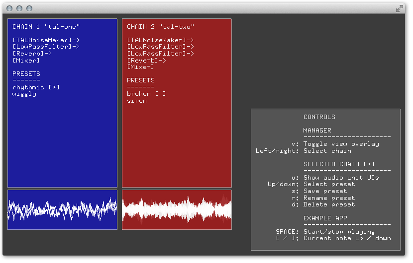

ofxAudioUnitManager
===================
This addon is a leightweight manager for Adam Carlucci's excellent [ofxAudioUnit](https://github.com/admsyn/ofxAudioUnit).

You can show and hide the control panel above by hitting 'v', allowing you to use this addon neatly with other addons and your own code.

Why not just use ofxAudioUnit?
------------------------------
ofxAudioUnit does a fantastic job of bridging [openFrameworks](http://openframeworks.cc/) and [Audio Units](http://logic-pro-expert.com/logic-pro-blog/2011/10/11/another-38-free-audio-unit-plugins-worth-checking-out.html). There are a number of ways of using it, but it's common to want to:

1. Send MIDI to a synth or sound-generating unit
2. Plug the output from the synth through a chain of effects and processors
3. At the end of that chain, plug the output to a mixer which goes to your sound card

While using ofxAudioUnit for [projects](https://vimeo.com/112347647), I found a typical workflow to be:

1. Experiment with different combinations of synths and effects until you establish a suitable 'chain' of units
2. Experiment with that chain and discover it's potential with different parameters and MIDI sequences
3. Establish more chains and experiment with mixing them together

The problem is that with ofxAudioUnit alone, that workflow involves a lot of programming, recompiling, running and more programming. In other words, you have to keep switching between sound design and engineering mindsets every few minutes.

What you really want to do is focus on sound design.

How ofxAudioUnitManager helps
-----------------------------

This addon wraps up most of the engineering either via the computer keyboard-controlled UI or by letting you extend [base](https://github.com/microcosm/ofxAudioUnitManager/blob/master/src/AudioUnits/AudioUnitBase.cpp) [classes](https://github.com/microcosm/ofxAudioUnitManager/blob/master/src/AudioUnitChains/AudioUnitChain.cpp) which do most of the work.

What ofxAudioUnitManager does is allow you to:

1. Create new units and unit chains with very little code, and in a repeatable fashion
2. Use your computer keyboard to manage (play, save, rename, and delete) presets across entire chains at runtime
3. Use a hassle-free template for composing programmatic real-time MIDI behaviour using [ofxMidi](https://github.com/danomatika/ofxMidi) and [ofxBpm](https://github.com/mirrorboy714/ofxBpm)

This allows you to focus on sound design, leaving you with only minor engineering tasks which you can accomplish by copying established patterns.

How to try out this addon
-------------------------
1. Clone [ofxAudioUnit](https://github.com/admsyn/ofxAudioUnit), follow the instructions in the readme, and make sure it works
2. Clone this addon and it's dependencies (listed below)
3. Install [alchemy player](https://www.camelaudio.com/) (the examples use this as the synth)
3. Launch the example project and try out the key controls listed on the screen

How to create new units & chains
--------------------------------
TODO

Dependencies
------------
- [ofxAudioUnit](https://github.com/admsyn/ofxAudioUnit)
- [ofxMidi](https://github.com/danomatika/ofxMidi)
- [ofxBpm](https://github.com/mirrorboy714/ofxBpm)
- [alchemy player](https://www.camelaudio.com/) if you want to run the examples

Tested against [openFrameworks 0.8.4](http://openframeworks.cc/download/).